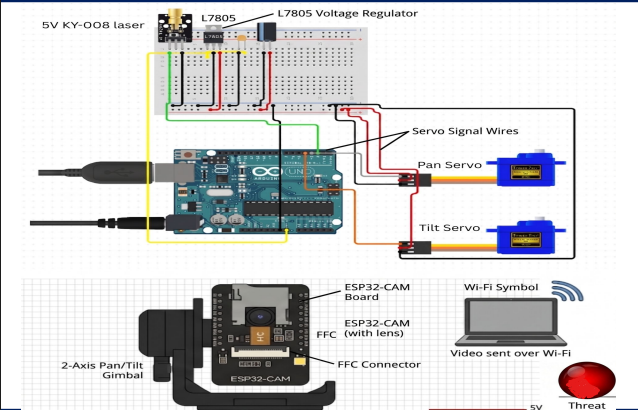
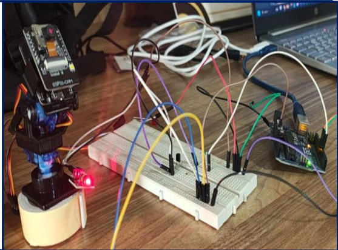

# ESP32-CAM Threat Demo Server

This project provides a FastAPI server for a simple prototype defense demo:

- reads frames from an ESP32-CAM stream
- detects a red object as the mock threat
- draws a danger rectangle and center point
- prints threat coordinates to the console
- exposes a live MJPEG feed and JSON status endpoints



## Setup

1. Install dependencies:

```bash
pip install -r requirements.txt
```

2. Run the server:

```bash
uvicorn app.main:app --reload --host 0.0.0.0 --port 8000
```

3. Open the dashboard:

- http://127.0.0.1:8000/

## Camera source

The ESP32-CAM default firmware usually serves a control page at:

- http://10.162.114.57/

Open that page in a browser and click **Start Stream** first. The actual MJPEG feed is then available on the camera's stream endpoint, which the app tries automatically.

By default the app uses:

- http://10.162.114.57/

If your ESP32-CAM serves the stream on a different URL, set:

```bash
set ESP32_CAM_URL=http://10.162.114.57/
```

You can also provide extra fallback stream URLs:

```bash
set ESP32_CAM_EXTRA_URLS=http://10.162.114.57:81/stream,http://10.162.114.57/stream
```

The app tries common ESP32 stream URLs automatically, including `/stream` and `:81/stream`, after you start the stream from the camera page.

## Laptop camera mode (optional)

You can switch video input from ESP32-CAM to your laptop webcam using `.env`:

- `CAMERA_SOURCE_MODE=esp32` uses ESP32-CAM (default)
- `CAMERA_SOURCE_MODE=laptop` uses local webcam
- `LAPTOP_CAMERA_INDEX=0` selects webcam index (try 1, 2 if needed)

After changing these values, restart the FastAPI server.

## Endpoints

- `/` - simple dashboard
- `/video_feed` - processed MJPEG stream with detection overlay
- `/detection` - latest detection JSON
- `/coordinates` - latest target coordinates only
- `/health` - basic status

## Arduino Uno Servo Tracking

This project can send pan commands from FastAPI to an Arduino Uno over USB serial.

### 1) Flash the Uno sketch

- Open `arduino_uno_servo_tracker/arduino_uno_servo_tracker.ino` in Arduino IDE
- Select your Uno board and COM port
- Upload

### 2) Wiring (Uno + servo)

- Servo signal (orange/yellow) -> Uno D9
- Servo GND (brown/black) -> external 5V supply GND
- Servo +5V (red) -> external 5V supply +
- Uno GND -> external 5V supply GND (common ground is required)

Do not power the servo from the Uno 5V pin for continuous tracking.

### Optional: 2-axis pan/tilt bracket (SG90 x2)

If using a pan/tilt camera bracket with two SG90 motors:

- Pan servo signal -> Uno D9
- Tilt servo signal -> Uno D10
- Pan servo +5V -> external 5V supply +
- Tilt servo +5V -> external 5V supply +
- Pan servo GND -> external 5V supply GND
- Tilt servo GND -> external 5V supply GND
- Uno GND -> external 5V supply GND (common ground)

Enable in `.env`:

- `SERVO_PAN_TILT_ENABLED=1`

Tilt tuning variables:

- `SERVO_TILT_KP`
- `SERVO_TILT_DEADBAND` or `SERVO_TILT_DEADBAND_PX`
- `SERVO_TILT_MIN_ANGLE` / `SERVO_TILT_MAX_ANGLE`
- `SERVO_START_TILT`
- `SERVO_TILT_INVERT` (`1` or `0`)

### 3) Enable servo bridge in FastAPI

PowerShell example:

```powershell
$env:SERVO_ENABLED = "1"
$env:SERVO_SERIAL_PORT = "COM5"
$env:SERVO_BAUD = "115200"
c:/Users/Akshat/Desktop/MPCAMini/.venv/Scripts/python.exe -m uvicorn app.main:app --host 127.0.0.1 --port 8000
```

Optional tuning:

- `SERVO_KP` (default `25.0`) tracking aggressiveness
- `SERVO_DEADBAND` (default `0.05`) ignore tiny jitter
- `SERVO_MIN_ANGLE` / `SERVO_MAX_ANGLE` mechanical limits
- `SERVO_START_PAN` initial angle

## Laser or LED Threat Output (optional)

You can mount a small LED or laser module on top of the servo horn so it physically moves with the camera direction. The software now turns this output ON while a threat is detected and OFF when no threat is detected.

### Arduino pin used

- Output control pin: Uno D7
- Command from FastAPI: `LASER:1` / `LASER:0` (or `LED:1` / `LED:0`)

### Wiring for a normal LED

- Uno D7 -> 220 ohm resistor -> LED anode (+)
- LED cathode (-) -> GND

### Wiring for a laser module

Most laser modules should not be driven directly from a Uno pin. Use a transistor switch:

- Uno D7 -> 1k resistor -> NPN base (2N2222)
- NPN emitter -> GND
- NPN collector -> laser module negative (-)
- Laser module positive (+) -> +5V external supply
- Uno GND -> external supply GND (common ground)

If your module has an integrated driver board and very low current draw, direct drive might work, but transistor drive is safer and recommended.

### FastAPI config

Set in `.env`:

- `THREAT_OUTPUT_ENABLED=1`
- `THREAT_OUTPUT_MODE=LASER` (or `LED`)

## Notes

This is a prototype detector, not a weapon system. FastAPI sends real-time pan and threat output commands to the Uno over serial.
